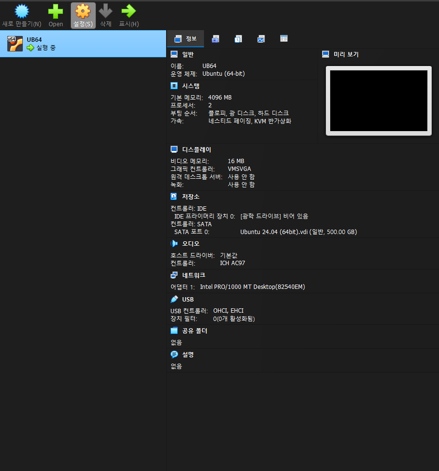

# 1. VirtualBox 가상머신 생성

## 설정 내용

- VM 이름: `UB64`
- OS: Ubuntu 24.04 (64-bit)
- 메모리: 4096 MB
- 프로세서: 2 core
- 부팅 순서: 플로피 → 광 디스크 → 하드 디스크
- 가속: 네스티드 페이징, KVM 반가상화 사용
- 디스크: SATA 컨트롤러, `Ubuntu 24.04 (64bit).vdi` (동적 할당, 500.00 GB)
- 오디오: ICH AC97 컨트롤러
- 네트워크 어댑터: Intel PRO/1000 MT Desktop (82540EM)
- USB 컨트롤러: OHCI, EHCI

## 확인 사항
VirtualBox 관리자의 "정보" 탭에서 위 시스템/디스플레이/저장소/오디오/네트워크 구성을
한눈에 확인할 수 있었습니다. VM이 정상적으로 "실행 중" 상태로 부팅되는 것을 확인했습니다.

## 스크린샷

