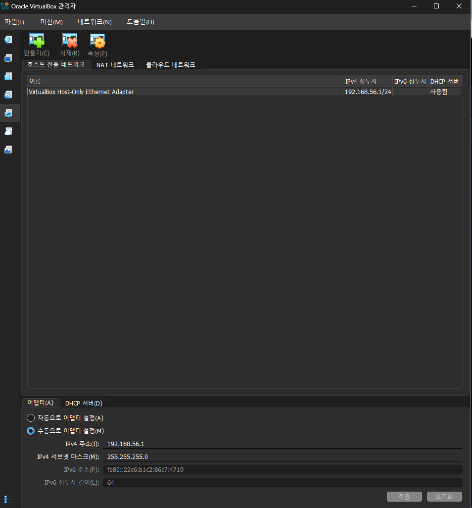

# 2. Host-Only 네트워크 구성

## 설정 내용

VirtualBox 관리자 → 네트워크 → 호스트 전용 네트워크에서 어댑터 구성:

- 어댑터: `VirtualBox Host-Only Ethernet Adapter`
- IPv4 주소: `192.168.56.1`
- IPv4 서브넷 마스크: `255.255.255.0`
- IPv6 주소: `fe80::22c6:b1c2:86c7:4719` (링크 로컬)
- DHCP 서버: 사용함

## 목적
호스트 PC와 VM 간에 격리된 사설 네트워크 경로를 확보하여, 이후 단계에서
SSH 접속(MobaXterm, VSCode Remote-SSH)에 사용할 네트워크 기반을 마련했습니다.

## 스크린샷

