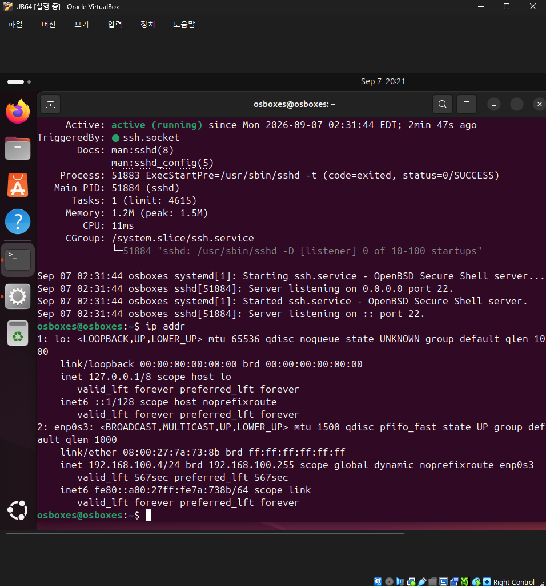

# 3. Ubuntu VM 내 SSH 서버 설정

## 확인 내용

VM 콘솔에서 SSH 서비스 상태 확인:

```
Active: active (running) since Mon 2026-09-07 02:31:44 EDT
Main PID: 51884 (sshd)
Server listening on 0.0.0.0 port 22.
Server listening on :: port 22.
```

`ip addr` 결과로 네트워크 인터페이스 확인:

- `lo`: 127.0.0.1 (루프백)
- `enp0s3`: `192.168.100.4/24` (DHCP 동적 할당, 외부 통신용 인터페이스)

## 확인 사항
SSH 데몬(sshd)이 22번 포트에서 IPv4/IPv6 모두 정상적으로 리스닝 중임을 확인했습니다.
이 인터페이스를 통해 이후 MobaXterm과 VSCode에서 SSH 접속을 진행했습니다.

## 스크린샷

