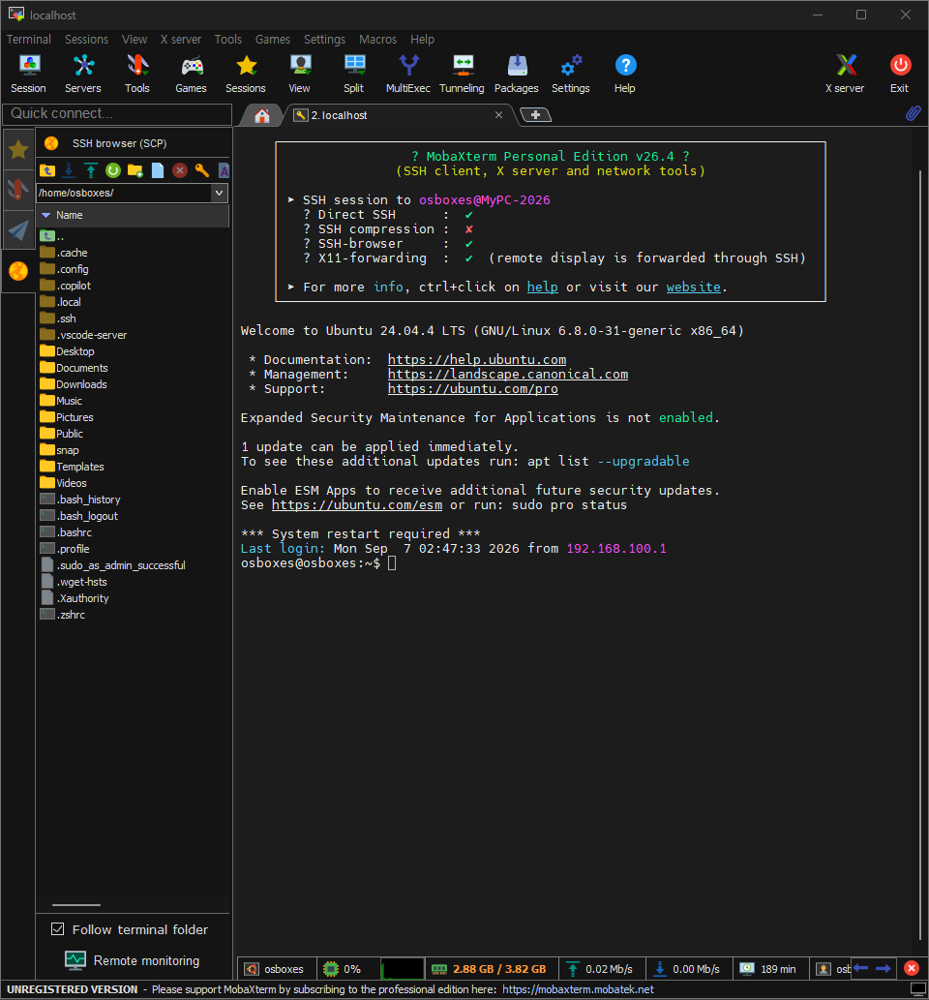

# 4. MobaXterm으로 SSH 접속

## 접속 내용

- 접속 세션: `osboxes@MyPC-2026`
- 접속 방식: Direct SSH
- SSH-browser(SCP): 활성화 (파일 탐색 및 전송 가능)
- X11 forwarding: 활성화 (원격 GUI 디스플레이 포워딩 가능)
- 접속 대상 OS: Ubuntu 24.04.4 LTS (GNU/Linux 6.8.0-31-generic x86_64)

## 확인 사항
MobaXterm 좌측 파일 탐색기에서 홈 디렉토리(`/home/osboxes/`) 구조를 확인했고,
SFTP 기반 파일 브라우징이 정상 동작하는 것을 확인했습니다.
터미널에서도 Ubuntu 환영 메시지와 함께 정상적으로 셸 접속이 이루어졌습니다.

## 스크린샷

