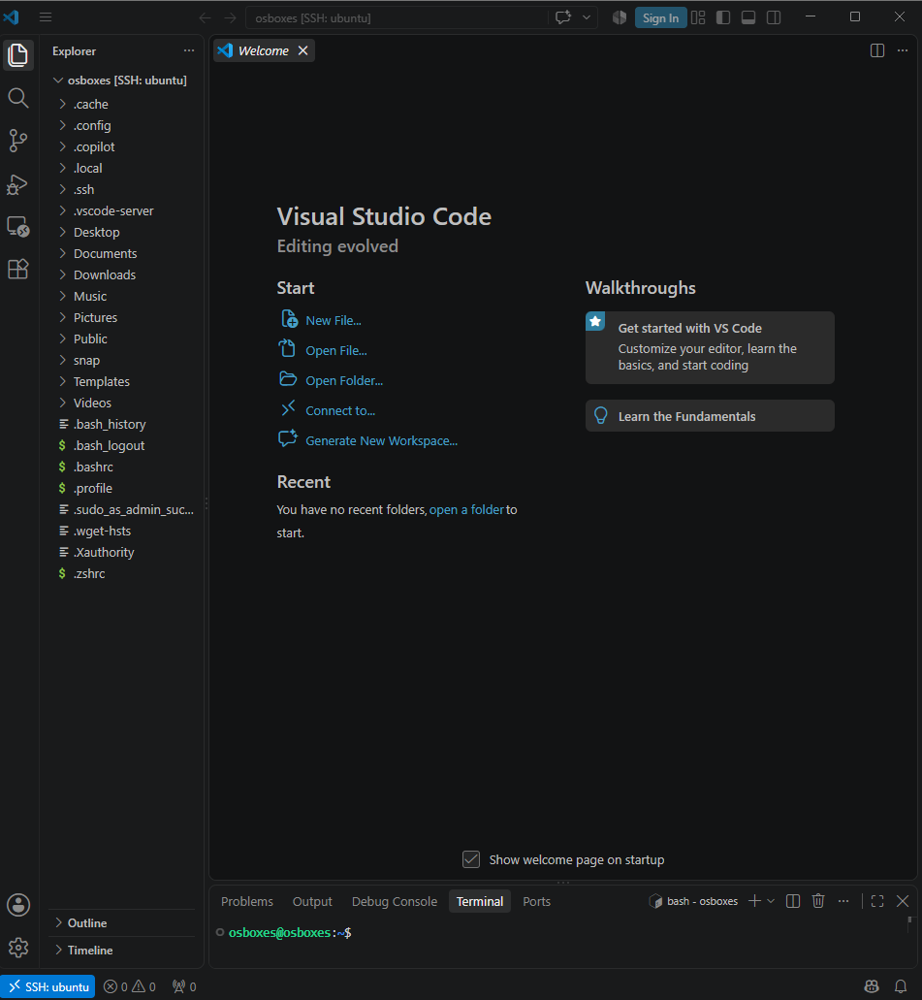

# 5. VSCode Remote-SSH 연결

## 연결 내용

- Remote 대상: `osboxes [SSH: ubuntu]`
- VSCode가 원격 서버(`.vscode-server`)를 통해 VM에 접속
- Explorer에서 원격 파일 시스템(`/home/osboxes`) 탐색 가능
- 통합 터미널에서 `osboxes@osboxes:~$` 프롬프트로 원격 셸 직접 사용 가능

## 확인 사항
로컬 PC의 VSCode UI에서 VM 내부 파일 편집과 터미널 명령 실행이 모두 가능한 상태를
확인했습니다. 이를 통해 VirtualBox VM을 로컬처럼 편리하게 사용할 수 있는
원격 개발 환경 구성을 완료했습니다.

## 스크린샷

